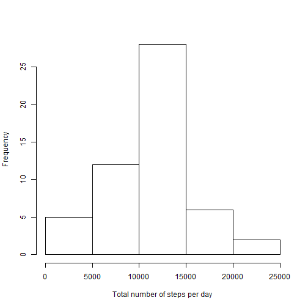
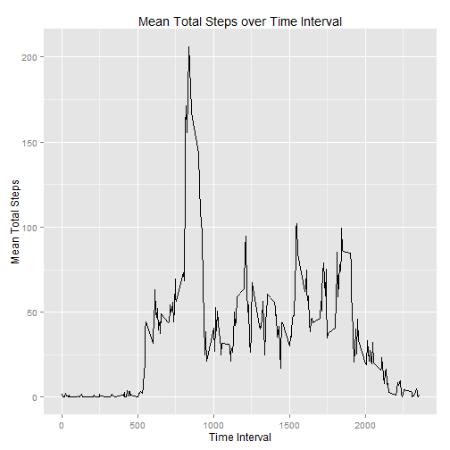
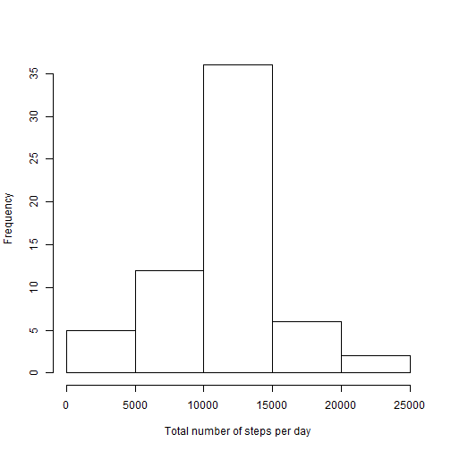
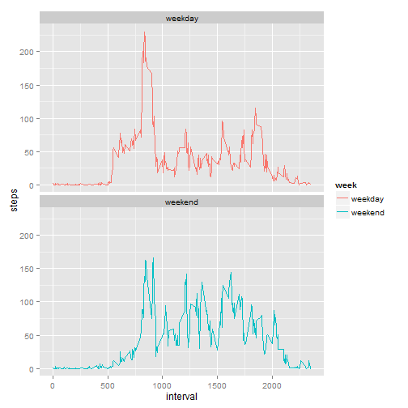

#PA1_template.Rmd

Read and preprocess the data by removing rows with missing data.


```r
#Set the output options for numbers
options(scipen = 9, digits = 3 )

activity_data <- read.csv("activity.csv")
activity_data <- subset(activity_data, !is.na(activity_data$steps))
```

###What is mean total number of steps taken per day?

Add the number of steps daily and plot a histogram showing the total
number of steps for each day


```r
sum_by_day <-aggregate(activity_data$steps, by=list(activity_data$date), "sum", na.rm=TRUE)
colnames(sum_by_day) <- c("Date", "Steps")
hist(sum_by_day$Steps, xlab="Total number of steps per day", main=NULL)
```

 

Calculate the mean and median of steps for each day

```r
mean_steps <- mean(sum_by_day$Steps)
median_steps <- median(sum_by_day$Steps)
```
The mean total number of steps taken per day is 10766.189

The median total number of steps taken per day is 10765


###What is the average daily activity pattern?

Calculate the average number of steps per interval across all days

```r
mean_by_interval <-aggregate(activity_data$steps, 
                             by=list(activity_data$interval), "mean")
colnames(mean_by_interval) <- c("Interval", "MeanSteps")
library(ggplot2)
```

```
## Warning: package 'ggplot2' was built under R version 3.1.3
```

```r
ggplot(data = mean_by_interval, aes(Interval, MeanSteps)) + geom_line() + 
  labs(title="Mean Total Steps over Time Interval", x="Time Interval", 
       y="Mean Total Steps")
```

 


The 835
interval contains the maximum number of steps.

### Imputing missing values

Calculate and report the total number of missing values in the dataset 
(i.e. the total number of rows with  NA s)


```r
activity_data_with_NA <- read.csv("activity.csv")
na_rows <- length(activity_data_with_NA$steps) - 
            length(na.omit(activity_data_with_NA$steps))
```

There are 2304 rows with NA values

Next we will fill in the NA values in the activity data with the mean total 
steps for that interval and calculate the new total steps for each day.


```r
Data <- activity_data_with_NA

row.names(mean_by_interval) <- mean_by_interval$interval
ind <- which(is.na(Data$steps))
Data[ind,1] <- mean_by_interval[as.factor(Data[ind,3]),2]

sum_by_day_1 <-aggregate(Data$steps, by=list(Data$date), "sum", na.rm=TRUE)
colnames(sum_by_day_1) <- c("Date", "Steps")
```

####Histogram of New Estimate


```r
hist(sum_by_day_1$Steps, xlab="Total number of steps per day", main=NULL)
```

 

The new mean is 10766.189 and the new median is 
10766.189

####Do these values differ from the estimates from the first part of the assignment?

The new and old mean are the same (10766.189) while the new median
is different from the old (10765 vs. 10766.189).

By imputing missing data, there is an increased number of samples used in the calculation 
of the results.

### Are there differences in activity patterns between weekdays and weekends?

Create a new factor variable in the dataset with two levels -- "weekday" and 
"weekend" indicating whether a given date is a weekday or weekend day.


```r
Data$day <- weekdays(as.Date(Data$date))

Data$week <- "weekday"
Data[Data$day=="Saturday",5]<-"weekend"
Data[Data$day=="Sunday",5]<-"weekend"

Data$week <- as.factor(Data$week)

library(plyr)
mean_steps_w <- ddply(Data, .(interval,week), summarize, steps = mean(steps, na.rm=TRUE))
```

### Plot of the average number of steps taken each interval during weekends and weekdays


```r
ggplot(data=mean_steps_w, aes(x=interval, y=steps, group=week)) + 
  geom_line(aes(color=week))+ facet_wrap(~ week, nrow=2)
```

 
